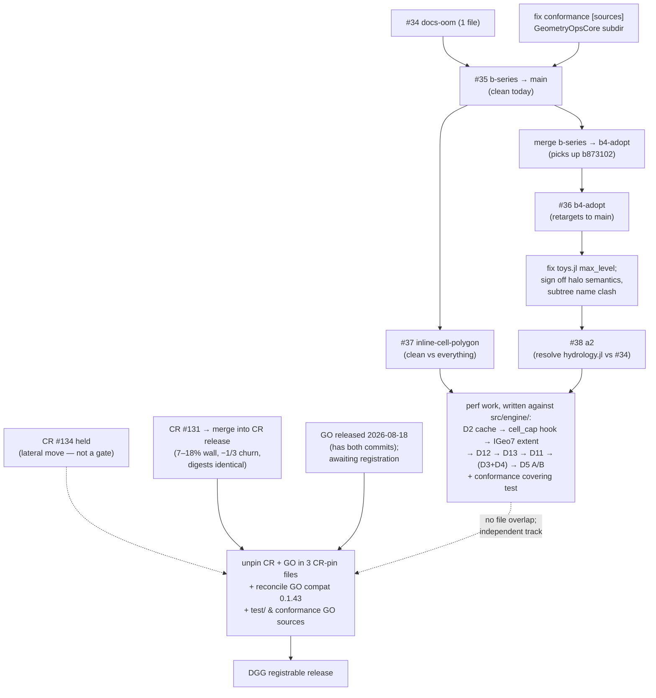

# 2026-08-18 — Integration plan for #34–#38 and the perf work (plan only, nothing merged)

Method: five parallel read-only investigations over `origin/*` refs at `origin/main = 05cd9d8` — PR content audits of #35/#36 and #38, a `git merge-tree --write-tree` conflict matrix (git 2.43.0) plus sequential trial merges in throwaway worktrees, a full read of `regrid-notes/perf-P3-brief.md` (717 L) with spot-verification against `src/`, and `gh pr checks` / `gh run list` for CI state. No branch, PR, or tracked file was modified. Every claim below was verified by command output, not read off the PR descriptions.

## Corrections to the working assumptions

1. **`origin/main` is `05cd9d8`, not `79e1b0`.** The local checkout is 3 behind (`cd46e43` license, `879a730` remove regrid-notes from tracking, `05cd9d8` IGeo7 license todo). The stack branches (#35/#36/#38) are based on the **current** tip; #34 and #37 are based on `79e1b0` — harmless, both merge clean.
2. **The stack is not linear.** `merge-base(b-series, b4-adopt) = d4e9ce0 = b-series~1`: `b4-adopt` (and hence `a2`) lacks `b873102` ("docs: render the Zarr extension's dggread/dggwrite docstrings"). This is the source of the only stack-internal conflict (`docs/make.jl`, 2 lines, keep-both) and a live regression risk: merged naively, #36/#38 can silently drop the Zarr docstring line.
3. **"MERGEABLE" is real but CI red is not PR-caused.** All five PRs fail `Julia 1.11 - ubuntu` with the *same seven tests that fail on `main` itself* (run 32038946295: IGeo7:684, H3:432–435 ×4, A5:597, crosssystem/neighborhood:136 — line numbers shift per branch, names don't). `Documentation` red is the runner-shutdown OOM that #34 exists to fix. `Conformance (generic fallbacks)` — the job #35 adds — **has never executed a test**: it dies in `Pkg.instantiate()` with a GeometryOps/GeometryOpsCore UUID mismatch because `lib/DiscreteGlobalGridsConformanceTesting/Project.toml` `[sources]` pins `GeometryOps` `rev = "main"` with no `GeometryOpsCore = {subdir = "GeometryOpsCore"}` companion (the root `Project.toml` has one). One-line fix, belongs on `claude/b-series` before #35 merges.
4. **#36 is not a plain adoption — it reverses #35.** #35's B2 documents `max_neighbors` as required-with-no-default ("a system that has not thought about the bound gets a `MethodError`", `src/interface/system.jl`); #36 replaces that exact paragraph with `max_neighbors(::AbstractHierarchicalGridSystem, ::Connectivity) = nothing`. Merging the stack means #36's doctrine wins. Fine — but it is a decision, not a detail.
5. **The perf briefs never mention #35–#38.** The only PR numbers in `regrid-notes/` are ConservativeRegridding #131/#133/#134. The interaction analysis below is new evidence, not brief content.

## Headline

1. **Merge order: #34 → (fix conformance CI on b-series) → #35 → #37 → #36 → #38 → perf work.** #34 and #37 are independent and clean everywhere; the stack is real and lands in dependency order; the perf work is written **after** #38, against `src/engine/` paths and the new names.
2. **The stack stays a stack.** #36 → main separation costs a partial rewrite (5 conflicted files; its `_run!` hunks call `_reporting`, which has zero occurrences on main — `#35` B11 introduces it; its tests need `IdentifiedSystem`, its docs `@ref` `AbstractQuadFaceGridSystem`, both #35-only). #38 → main is **not separable**: 34 conflicted files / 62 hunks + 7 modify/delete pairs, because #38's `fallbacks/ → engine/` move renames files #35 *created* (`quad_face.jl`, `region_algebra.jl`). #38 → b-series (dropping only #36) conflicts in 10 files, 9 of which are exactly B4's capacity machinery under the new spelling (`src/engine/adjacency.jl:157` calls `_capacity`, a #36 symbol). Separation buys nothing; sequencing costs nothing extra.
3. **Perf after #38, and the argument is asymmetric: the perf diffs do not exist yet.** "Rebase the perf work over the rename" is only a cost if the perf work is written first. Written after, the cost is zero — and written before, it is guaranteed: #38 moves `src/fallbacks/{cursor,position_tree}.jl` to `src/engine/` (content R099/R100 — near-byte-identical), renames `max_neighbors → maxneighbors` (105 occurrences), `max_level → maxlevel` (146), `rim → border` across ~55 touchpoints in the IGeo7 + conformance perf surface. Meanwhile half the perf surface is untouched by #38 in any order: `src/fallbacks/caps.jl`, `src/fallbacks/geometry.jl`, `src/regridding.jl`, `lib/GlobalRegridding/src/conservative.jl`, all three CR pin files, and 4/7 IGeo7 files.
4. **Only two textual conflicts exist in the whole matrix, both trivial**: `docs/make.jl` (2 lines, keep-both — pre-empted by merging b-series into b4-adopt first) and `docs/src/tutorials/hydrology.jl` (#34's OOM prose rewrite vs #38's `rim→border` wording, 3 lines).
5. **The external gates (CR/GeometryOps) touch nothing the PRs touch.** No PR edits the three CR pin files (`Project.toml:31`, `lib/GlobalRegridding/Project.toml:22`, `docs/Project.toml:29`). Unpinning is a separate track, now in motion (status 2026-08-18): the GeometryOps release containing `9f0d16006` (`node_extent_is_expensive`) + `b37a02b69` (`SutherlandHodgmanCache`) is cut and awaiting registration; ConservativeRegridding gets merged and released once GO registers, with **CR #131 merged into that release** (recommendation delivered: 7–18% wall, −1/3 plan churn, digests identical — the merge also moots the branch's missing #133 vcat fix). **CR #134 is held** — lateral move, no longer a gate. The budget-frontier threading policy ships as its own later CR PR, pending the wave-3 wall-clock verdict (policy doc to land at `regrid-notes/2026-08-18-threading-policy.md`). Until the new GO version registers, DGG cannot build against tagged GO v0.1.43 (`UndefVarError` at load — the trait is *defined on* at `src/fallbacks/position_tree.jl:120`, `lib/GlobalRegridding/src/conservative.jl:87,201`, and two sites the brief missed: `src/regridding.jl:198`, `src/fallbacks/cursor.jl:192`). Release-blocker inventory beyond the brief: `lib/GlobalRegridding/Project.toml:31` declares `[compat] GeometryOps = "0.1.43"` while its `[sources]` override contradicts it; #35's B1 already moves the `as/dualdfs-carry-extents` GO pins to `main`.

## Per-PR disposition

| PR | verdict | reason |
|---|---|---|
| **#34** docs-oom | **Merge first, as-is** | 1 file, clean vs main/#35/#36/#37; fixes the Documentation OOM that reds most branches. Its only conflict is with #38 (3 prose lines in `hydrology.jl`) — landing first puts the resolution into #38's final merge, where the `rim→border` renamer is the right party to resolve it. |
| **#35** b-series | **Merge second, after two pre-merge fixes** | `merge-tree origin/main × b-series` → clean (tree `b20d738f`). Pre-merge: (a) add `GeometryOpsCore = {url…, subdir = "GeometryOpsCore"}` to the conformance lib `[sources]` so the Conformance job runs at all; (b) reviewer sign-off on the three real contract changes it ships: B5's ordering flip (three `sort!` deletions in `src/fallbacks/stencil.jl`, `_swept_rows` unsorted — every position-form consumer that assumed ascending breaks silently), B12's `Near`-throws, B10's regrid-to-RasterGrid `(X, Y)` output shape. B8's "bit-identical" quad-face claim rests on suite counts (986,750 vs 986,333), not shown equivalence — spot-check S2/HEALPix/ISEA4R oracles if paranoid. |
| **#37** inline-cell-polygon | **Merge third, as-is** | Clean vs main, b-series, and a2 tip (`merge-tree` D and E, both clean). Overlaps #35/#38 only in `src/interface/grid.jl` / IGeo7, on disjoint line ranges (its `grid.jl:187` hunk sits below #35's earliest at 287 and #38's at 321). It must land before the perf cursor cache is written: the inline ring it introduces **is** the cache payload (R1 caches `cell_polygon` output). Now quantified (`alloc-attribution.md`, measured 2026-08-18): its diff covers all three sites of the 720 B/pair clip-loop boundary chain (`IGeo7/system.jl:287`, `IGeo7/z7grid.jl:211`, `fallbacks/geometry.jl:14`) — ≈5.1 GiB ≈ 27% of eager plan churn at 1024², ~×12 at full tile. It does **not** cover `cursor.jl:269`'s descent-side cap rebuilds (4.0 GiB) — that is the brief's cap-memoization work (D2/D2a), not this PR. |
| **#36** b4-adopt | **Merge fourth — but merge `b-series` into it first** | Picks up `b873102`, eliminating the `docs/make.jl` conflict and the Zarr-docstring regression risk. GitHub retargets it to `main` when #35 merges. Content is sound: declared-bound systems keep the identical `Val(M)`/`SmallVector` path; only undeclaring systems change (`MethodError` → working `Vector` path). The B2-doctrine reversal (correction 4) is accepted by merging it. |
| **#38** a2 | **Merge fifth, after three fixes** | (a) fix `benchmark/toys.jl:37-38` — still calls the deleted `DGG.max_level`, so `benchmark/maxneighbors.jl` (which includes it at :25) is broken; CI is green only because benchmarks aren't in the suite. (b) resolve `hydrology.jl` against #34 (keep #34's structure, #38's `border` wording). (c) owner sign-off on the two sharpest edges: **`halo` silently changes element type** — base yields cell ids (`src/fallbacks/halo.jl:180-205`), a2 yields positions by default (`src/engine/region.jl:19-23`), same call syntax, no depwarn (defensible pre-registration, but it must be a decision); and the new exported `DiscreteGlobalGrids.subtree` collides with `GlobalRegridding.subtree` (`src/regridding.jl:150,156` + 8 sites in `conservative.jl`) — compiles today because in-repo uses are qualified, but `using` both makes bare `subtree` ambiguous. Consider renaming the GR-internal one before it leaks. Also note `adjacency` is *not* `halo_table` renamed (CSR, `k == 1` only, `halo > 1` throws pointing at `grow`) — any downstream `halo_table(…, k)` user has no migration path but `grow`. |
| **Perf work** | **Write after #38 lands, against `src/engine/` + new names** | Order per the briefs' own dependency chain: D2 cursor cache first (−28.6%, 1.40×; note the cursor struct gains a field, so `_chunkcursor` at `src/regridding.jl:165-175` — positional construction — must follow), then the `cell_cap` hook (hard prerequisite for the analytic extent; post-#38 it must also decide whether the generic stays in `Fallbacks` at `caps.jl:81` or moves to `interface/`, and update `src/engine/engine.jl:38`'s import list), then IGeo7 analytic `node_extent`/`cell_cap` (K_cell 1.18 / K_node 1.25; marginal wall −0.6 s once the cache exists, but it unlocks `node_extent_is_expensive = false` and covers the 10/22 tiles where the cache disengages), then D12 (~−12% for ~10 lines, `caps.jl:67-70` + `rastergrid.jl:610-613`), D13 (`rastergrid.jl:802-803`), D11 (counting R1+R4 ≈ −20 s, not −22.6). **D3 and D4 together or not at all**: fixing `_chunklevel`'s local-vs-global count bug (`src/regridding.jl:70-77`) without fixing `_chunkwindows`'s global-level scan (`:82-97`) yields a chunk level that cannot be built. D5 bucket A/B strictly last. Conformance covering-test work (D1b: depth ≥ 6/branch ≥ 3, pentagon one-rings, new `tree_covering_problems`) after #38 since the lib is renamed. Churn attribution is now measured (`alloc-attribution.md`, 2026-08-18; eager `plan_regrid`, 1024², 1 thread, 18.44 GB): destination cell geometry 52.9% (4.0 GiB descent-side cap rebuilds at `cursor.jl:269` — the `cell_cap`-hook/analytic-cap items above; 5.1 GiB clip-loop boundary chain — removed wholesale by #37), spherical area 14.9%, SH clip 13.0% (all returned polygons, zero scratch left — CR #131's cache already removes 33.3% of no-cache churn at 1221 B/pair, ~111 GB at full tile; further clip wins need an area-only operator, upstream), source pixel geometry 10.4%; full-tile scale factor measured 11.99× (exponent 0.985). The numbers confirm, and do not reorder, the D-sequence above. Re-measure the P3 baseline once on the post-stack tree before writing patches — B5's `_wind!` keyed sort and #37's inline ring shift the ground slightly. |

## Why perf-after-#38, argued once

Landing #38 first forces perf to be written against `maxneighbors`/`src/engine/` — cost: none, the diffs don't exist yet, and the target files' *content* barely changes (`cursor.jl` R099 one comment word; `position_tree.jl` R100 byte-identical; `caps.jl`/`geometry.jl`/`regridding.jl` untouched). Writing perf first forces a rebase across a directory move plus ~55 rename touchpoints, with git's rename detection already marginal on one file in the move set (R040 `stencil.jl`), and re-opens the `cell_cap`-placement question mid-flight. The only cost of waiting is calendar time for the stack to merge — and the stack is textually clean today, so that time is review time, which the perf work does not shorten by jumping the queue.

## Conflict hot-spots and resolution assignments

| # | site | parties | resolution | who / when |
|---|---|---|---|---|
| 1 | `docs/make.jl` `modules=[...]` | b873102 (b-series) vs a2's `Engine` line | keep both lines | stack owner, by merging b-series → b4-adopt **before** #36 lands (pre-empts it entirely) |
| 2 | `docs/src/tutorials/hydrology.jl` (3 lines prose) | #34 vs #38 | #34's OOM restructure + #38's `border` wording | whoever drives #38's final merge |
| 3 | `src/interface/grid.jl` | #35 (287–366) + #37 (187) + #38 (321–445) | no textual conflict — disjoint ranges; post-merge, read the assembled docstrings once for coherence (`cell_polygon` inline-ring note vs region-verb contract) | #38 merger |
| 4 | `lib/…ConformanceTesting.jl` | #35 (+494) + #36 (+14) + #38 (rename pass) | handled by stack order; perf item F written after | perf author |
| 5 | `test/systems/crosssystem/subtree_halos.jl` | #35 ~30 hunks, #38 ~130, #37 one | merges clean; the file most worth a full-suite re-run rather than textual review | CI on the integrated tree |

One integrated 14-min suite run on the assembled tree (main + #34 + #35 + #37 + #36 + #38, in a scratch worktree) before merging #38 is the cheap insurance; `merge-tree` cleanliness is textual only.

## Dependency diagram

## Risks — what would falsify this plan

- **The 1.11 baseline is red on main** (7 failing tests). This plan merges onto red, on the evidence that no PR changes the failure set. If the owner requires green-before-merge, the order gains a step 0: fix main's 1.11 failures first — that work is unscoped here.
- **`merge-tree` cleanliness ≠ semantic compatibility.** The B5 ordering flip and #38's `halo` retype are exactly the kind of change that merges clean and breaks callers. The integrated-tree suite run is the mitigation; the conformance job must actually execute (fix in step 2) for its winding/cycle laws to count.
- **B8's "bit-identical" claim is unverified** beyond suite counts. If S2/HEALPix/ISEA4R behavior drifted, it surfaces as oracle failures only where oracles exist.
- **The −28.6% cache figure was measured pre-stack** on a loaded shared box (P3 medians spread 1.01–1.24×). #35's `_wind!` keyed sort and #37's inline ring touch adjacent paths; if the re-measured post-stack baseline moves materially, re-rank D2/D12/D13 before writing code — the plan's perf ordering, not its merge ordering, is what would change.
- **If #38's review rejects the `halo` retype or the hard-rename-no-shim policy**, the stack stalls at #36. Fallback: #34/#35/#37/#36 still land (all clean through that point); perf work then targets `src/fallbacks/` paths instead, accepting the future rename rebase. That is the only branch point where the perf-after-#38 decision inverts.
- **#36/#38 CI runs predate retargeting**; after #35 merges, re-run CI on the retargeted PRs rather than trusting the stack-base runs.

## Working-tree hygiene (binding on whoever merges)

`git status` on the local tree: ` M Project.toml` (adds `"bench"` to `[workspace] projects`), untracked `bench/`, `regrid-notes/perf-P3-brief.md`, `regrid-notes/perf-P3.md`. None of it goes into any commit — `regrid-notes/` was deliberately untracked in `879a730`, and the workspace edit is session-local. Explicit pathspecs only; never `git add -A`. All merge mechanics happen via PR merges or scratch worktrees, not this checkout (which is also 3 commits behind).

## Deliberately deferred — nothing silently dropped

- **#29 MOC storage, #33 CompactedEncoding** — out of scope by instruction. Note only: #38 exports `expand`/`compact`/`grow` (B15 region algebra) whose names sit near MOC vocabulary; when #29/#33 revive, reconcile against `src/engine/region_algebra.jl`.
- **#25 nine-systems, #27 oracle-zstd, #1 ISEA9R, #17 Zarr demo (draft)** — no file-level interaction found with #34–#38 or the perf surface; untouched.
- **CompatHelper #2–#9, #21** — deferred; several are mooted by the `[sources]` pins and should be batch-closed or regenerated at unpin time (the diagram's `UNPIN` node), not before.
- **Perf items deliberately not scheduled**: D7/R9 IGeo7 `cell_area` closed form (zero profile samples on this workload), `cells_cap` (0.14%), D5 bucket change without A/B, cap-nesting assertion (explicitly forbidden by the brief), D1/D1a/R8/D10-GO (upstream-owned).
- **CR unpin / DGG release** — tracked as the external gate chain, not blocked on and not blocking #34–#38 or the perf work (zero file overlap with the pin sites, verified). In motion as of 2026-08-18 — see headline 5 for release status.
